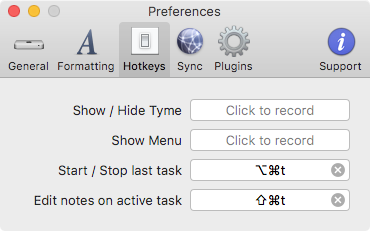

Tyme2 Daily Standup Report 
===============================================================================
> Generate a morning standup report from [Tyme2][tyme2] using AppleScript

The applescript fetches yesterdays work from [Tyme2][tyme2] and returns it in
a format ready for a Slack standup channel. On Monday, it will fetch all tasks
over the weekend as well.

## Quick start

Add the `bin` folder to your path and then run `standup`.

```bash
export PATH="/Users/craig/Projects/tyme2-standup/bin:$PATH"
```
This will fetch tasks from your previous day (with special weekend handling) and
will prompt you for todays tasks. Press enter to stop entering new tasks. It
will then prompt you about any blockers you're experiencing. Press enter to have
`none`. Once you've finished with the prompts, the morning standup report will
be in your clipboard and ready to share.

## Example

```bash
$ standup
*Yesterday*
- PR Review: #1045 Update report overview screen
- Company Meetings: All Hands Meeting
- PR Review: #45 Improve sample logo failure message
- Maintenance: Created #78 to add backoff rate to AWS connection
*Today*
- Meet with Steven about CMS integrations
- Bring work on #7364 for image processing
*Blockers*
- None
```

## Development

* Open the `Script Editor` application in OSX and open the
  `daily-standup.applescript` file.
* Drag the `Tyme2` application icon onto the `Script Editor` icon in the dock
  so that you can see the API that the app offers. Also check the reference at
  [Tyme2 Scripting](https://www.tyme-app.com/scripting2/)
* Edit the file
* Choose `File > Export...` and then choose the `bin/daily-standup.scpt` file
  and be sure to change the *File Format* to `Script`
* -*OR*-
* Run the `compile` script found in this repo

# Tyme2 Tips
This helper runs on Tyme2. Using it efficiently is key to liking this system.
I've found that setting it up properly is key.

1. Add global hotkeys to start and stop tasks
2. Prompt me for a task note when I start a task
3. Enable iCloud sync so I can work from several computers or track via my phone
4. Setup your projects and tasks to match your work

#### 1. Hotkey Preferences
<br>
This allows you to quickly start and stop tasks and record time.

#### 2. General Preferences
<br>
This prompts you when you **start** a task. You should start each task with a
purpose and the things you plan to accomplish. You can add a link to Trello card
or a GitHub issue.

#### 3. Synchronization
<br>
I work from both a desktop and a laptop, and I like being able to make my
morning report from either machine. This allows all of your devices to stay in
sync.

#### 4. Setup projects and tasks
You are free to setup your projects and tasks however you'd like. Keep in mind
that the reporter will include the task name in the summary. I have a fairly
extensive setup. Here's [a preview of my setup](docs/projects.png). Ive found
that this works for me and gives me nice charts and reports on the things that
I've been working on. Tyme2 is a little more aimed at contractors than at
individuals, so I tend to think of each major project as a client.

[tyme2]: http://tyme-app.com/
